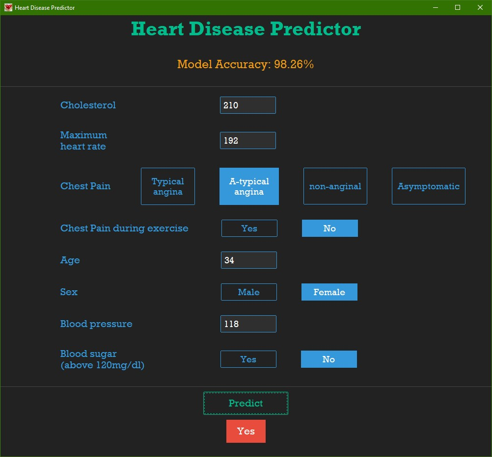

# Heart Disease Predictor
A Heart Disease predictor GUI made in Python using **Neural Network** ML model to predict the probability of Heart Disease.

## Project details

### Working
It takes $8$ parameters and do prediction based on them
- Age
- Sex (M / F)
- Chest Pain (4 types)
- Chest Pain during exercise (yes / no)
- trestbps - Resting blood pressure
- Maximum Heart Rate
- Blood sugar above 120mg/dl (yes / no)
- Cholesterol


### Model details
Model made using Neural Networks with accuracy of $98.26\%$ consists of total 3 layers
- $1^{st}$ hidden layer $18$ neurons (relu)
- $2^{nd}$ hidden layer $9$ neurons (relu)
- $3^{rd}$ output layer $1$ neuron (linear)

Used `BinaryCrossentropy()` loss function with `from_logits=True`, and convert predictions into sigmoid using `tf.nn.sigmoid(preds)` and `Adam` optimizer


### Clone
```
git clone https://github.com/Param302/Heart-Disease-predictor.git
```

### Software used
Python 3.10.2


### Setup before run
- Make sure to install all required libraries and module before using it:

```
pip install -r requirements.txt
```
- Run `main.py` file:

```
python main.py
```
