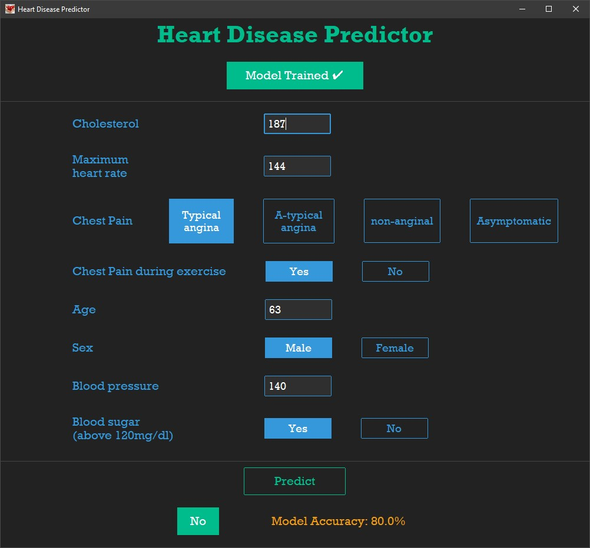

# Heart Disease Predictor
A Heart Disease predictor GUI made in Python which uses `Logistic Regression` ML model to predict the probability of Heart Disease.

This project is submitted to **MLH Birthday Bash Hackathon**.



### Clone
```
git clone https://github.com/Param302/Heart-Disease-predictor.git
```

### Software used
Python 3.10.2


### Setup before run
- Make sure to install all required libraries and module before using it:

```
pip install -r requirements.txt
```
- Run `main.py` file:

```
python main.py
```
